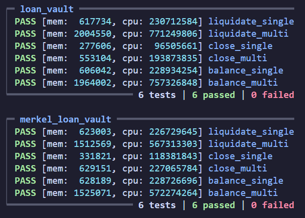

# ccf-loans

Currently working on optimising the `validators/init` validators into `validators/merkel`

The root `validators` dir has the current optimisation set,

For scope of contracts and documentation please refer to `notes` 

---

## Structure

```bash
.
├── aiken.lock
├── aiken.toml
├── draft.ts
├── initLucid.ts
├── lib
│   ├── ccfl
│   │   ├── helpers.ak # validator helper functions
│   │   └── types.ak # datums redeemers
│   ├── mockups # contract mockups
│   └── tests
│       ├── tools.ak # Test types and values
│       └── transactions.ak # Test Transaction helpers
├── notes # conceptual notes on validators
├── plutus.json # validator blueprint
├── README.md # You Are Here
└── validators
    ├── draft # first complete design
    ├── init # initial validators w/ tests
    ├── merkel # merkelised validators
    │   # current optimisation w/ tests
    ├── loan-vault.ak # Init LoanVault
    └── merkel-loan-vault.ak # Merkel LoanVault
```

## Building

```sh
aiken build
```

I have saved the script hashes in `lib/tests/tools.ak` so we can run the tests without
needing to build, so that we can have test functions to generate dynamic data.

## Testing

```sh
aiken check
```

The current tests compare `loan-vault.ak` to `merkel-loan-vault.ak`.

The merkel design pattern is about reducing script bloat to increase throughput. We can 
have several loans being manipulated each tx, without having to attach the whole script 
every time.

To compare the two validators, we have matching transactions:

Multi Transaction

- 3 `LoanInputs` interacting per Test
- 1 Test for each `LoanAction`

Single Transaction

- 1 `LoanInputs` interacting per test
- 1 Test for each `LoanAction`

Here were my results:



## Merkel Validator Design Pattern

This design pattern separates the redeemer cases out of the `init` into separate 
`staking` validators

It makes use of `withdraw 0` but in checks a different `stake credential` for each 
redeemer case

```rust

type LoanAction {
  SLBalance
  SLLiquidate
  SLClose
}

```

Becomes the `MerkelConfigDatum.loanRedeemers` in the reference input

```rust

pub type MerkelConfigDatum {
  loanVal: ScriptHash,
  colVal: ScriptHash,
  rewardsVal: ScriptHash,
  oracleVal: ScriptHash,
  loanRedeemers: List<ScriptHash>, // Here
  collateralRedeemers: List<ScriptHash>,
}

```

The script hashes are referenced by each spend redeemer, so it checks for that 
`StakeCredential`

```rust

// r.i is the redeemer that has an index of the List<ScriptHash>
...
expect Some(stakeVal) =
  cDatum.loanRedeemers
    |> list.at(r.i)
// checks in tx.withdrawals
dict.has_key(withdrawals, Inline(ScriptCredential(stakeVal)))
...

```

The withdrawal sripts themselves execute the validation logic against a list of inputs 
and outputs

```rust

fn loanBalance(r: List<(Int, Int)>, c: ScriptContext) {
  // This executes the same logic as the loan-vault Redeemer SLBalance
  // but it checks all of the inputs and outputs in the list
}

```

## Further Optimisation

I need to complete this optimisation benchmark for `init/collateral-validator` which is 
really the only one that needs the same level of treatment as the others dont

I need to do validator level optimisations after this transaction level phase has been 
done.

This will alow us to find ways of removing redundant checks in validation whilst 
guaranteeing all checks are sufficient on the lowest level.
