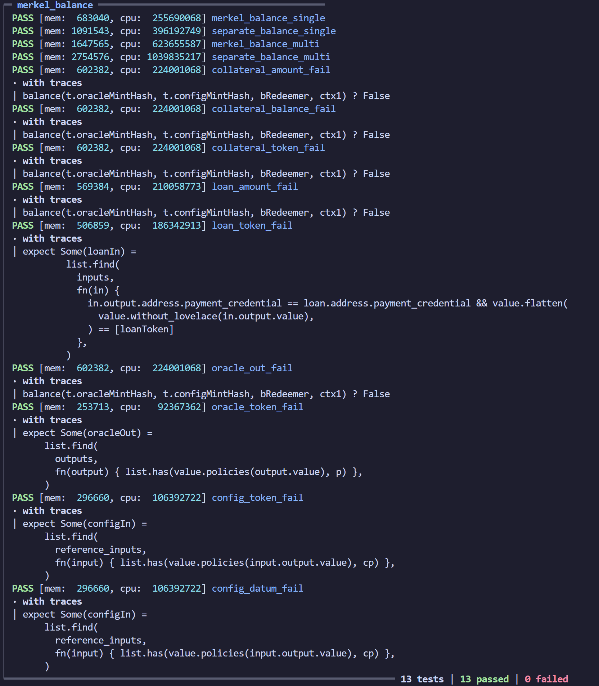

# ccf-loans

Currently working on optimising `validators/merkel` I have created a set of validators to
combine checks for `loan` and `collateral` validators

The root `validators` dir has the current optimisation set,

For scope of contracts and documentation please refer to `notes` 

---

## Structure

```bash
.
├── aiken.lock
├── aiken.toml
├── lib
│   ├── ccfl
│   │   ├── helpers.ak # validator helper functions
│   │   └── types.ak # datums redeemers
│   ├── mockups # contract mockups
│   └── tests
│       ├── tools.ak # Test types and values
│       └── transactions.ak # Test Transaction helpers
├── notes # conceptual notes on validators
├── plutus.json # validator blueprint
├── README.md # You Are Here
└── validators
    ├── draft # first complete design
    ├── init # initial validators w/ tests
    ├── merkel # merkelised validators
    │   # current optimisation w/ tests
    ├── merkel-balance.ak # Loan & Collateral w/ tests
    ├── merkel-close.ak # Loan & Collateral w/ tests
    └── merkel-liquidate.ak # Loan & Collateral w/ tests
```

## Building

```sh
aiken build
```

I have saved the script hashes in `lib/tests/tools.ak` so we can run the tests without
needing to build, so that we can have test functions to generate dynamic data.

## Testing

```sh
aiken check
```

I have refactored the tests to make them more readable and easier to adapt.

Now all of the test variables are easy to find and adjust to make it easy to test
different values, without haveng to search through 100+ lines of code to find the
appropriate value.

```rust
test merkel_balance_single() {
  let inRatio = 2
  let outRatio = 2

  let inLoanAmount = 1000
  let inCollateralAmount = 1000
  let inCollateralValue = 2000

  let outLoanAmount = 1000
  let outCollateralAmount = 1000
  let outCollateralValue = 2000

  ...
}
```

Changing these values will adjust the test data in different ways:

### Oracle Data (exchange rate)

This is the in/out exchange rate for the oracle, so the below example makes ADA $2

```rust
  let inRatio = 2
  let outRatio = 2
```

If you want to tests validators for different exchange rates you can change the `outRatio` as that is what is always used by the validators.

### Loan Amount (loanDatum.amount)

This is the recorded loan amount at the `loanDatum`

```rust
  let inLoanAmount = 1000

  ...

  let outLoanAmount = 1000
```

If you want to adjust this for your own testing, the validation logic always checks the
`outLoanAmount` against the `outRatio` above & `outCollateralValue` below.

### Collateral Value (loan collateral)

The amount of ADA or other tokens in the collateral UTxO

```rust
  let inCollateralValue = 2000

  ...

  let outCollateralValue = 2000
```

All of these validation tests are done on a single user input to make the tests smaller 
and easier to read/edit.

The larger (3 i/o) tests are done for throughput and benchmarking to understand the 
impact of different optimisations.

>NOTE: Currently theses tests only make it easy to adjust basic values, I have 
>implemented token checks but I havent made it easier to make token adjustments or output 
>address adjustments. This will be done at end of week.

We currently have 2 types of tests running with `aiken check`

1 - Validator proof tests -> verify logic to ensure expected behaviour
2 - Optimisation comparison tests -> see the improvements of the optimisations

Validator Tests:
- `balance` `liquidate` & `close` tests for expected behaviour
- failing tests for each element of Tx validation to prove things fail if incorrect

These are pretty standard tests with slight discrepencies in validation to check fail
cases e.g. Collateral output doesnt match Loan value & Oracle exchange rate

The current Optimisation Tests compare:
- combined redeemer cases for `merkel` validators
- `merkel-balance` combines `Balance` logic
- `merkel-close` combines `Close` logic
- `merkel-liquidate` combines `Liquidate` logic

The merkel design pattern is about reducing script bloat to increase throughput. We can 
have several loans being manipulated each tx, without having to attach the whole script 
every time.

To compare the two validators, we have matching transactions:

Multi Transaction

- 3 `LoanInputs` && `CollateralInputs` interacting per Test
- 1 Test for each `LoanAction` && `CollateralAction`

Single Transaction

- 1 `LoanInputs` && `CollateralInputs` interacting per Test
- 1 Test for each `LoanAction` && `CollateralAction`

Here were my latest test results:



This only shows one validator but the full scope of updated tests.

## Validator Architecture

Here is a brief description of the validators and their roles.

### Oracle - Onchain price feed (`mint` / `spend`)

Oracle Minting Policy:
  - onChain price token
  - mints, burns
  - sets initial tokenDatum

Oracle Validator:
  - onChain price feed
  - updates & closes feed
  - enforces tokenDatum

The Oracle is a token / validator pair which identify the correct data onchain.

This is checked in every loan transaction to guarantee we are always using the most up-to-date price for validation (by checking the oracle output)

### Config - ValidatorState reference_input (`mint` / `spend`)

Config Minting Policy:
  - onChain script feed
  - mints, burns
  - sets initial configDatum

Config Validator:
  - onChain script lookup
  - updates & closes feed
  - enforces configDatum

The Config is a token / validator pair which identifies the dapp state onchain by 
providing all of the script hashes of the other validators.

*Why not use parameters?*

Using parameters locks the validator to those parameters - if the parameters change, you 
are using a different vaildator.

Making them dynamic in this way adds bloat to the transactions, but it means we can 
update the other validators and it wont affect the rest of the dapp ( or even the users/
loans ).

### Rewards - Rewards Tokens (`mint`)

Rewards Minting Policy:
  - Mints Rewards Tokens

The Rewards Token is earned by maintaining a loan position, you accrue rewards periodicaly 
and can mint them when you close out your loan - meaning it has been returned.

If you are liquidated you will lose your rewards.

### Loans - Holds loanData (`mint` / `spend`)

Loan Minting Policy:
  - onChain Loan identifiers
  - mints, burns tokenPair
  - enforces datums & initial values

Loan Validator:
  - onChain loan state
  - updates, liquidates & closes loan
  - enforces loanDatum & collateralValue

Collateral Validator:
  - onChain collateral
  - updates, liquidates & closes loan
  - enforces collateralDatum & collateralValue

The Loans validators are the main logic of the dapp.

We have a minting policy which mints a loan token pair, one is sent to Loan Vault with 
the loan datum, the other goes to the collateral vault with the collateral.

We separate these values so they can be updated individually whilst maintaining the 
onchain connection with their loan token.

## Merkel Validator Design Pattern

This design pattern separates the redeemer cases out of the `init` into separate 
`staking` validators

It makes use of `withdraw 0` but in checks a different `stake credential` for each 
redeemer case

```rust

type LoanAction {
  SLBalance
  SLLiquidate
  SLClose
}

// && 

type CollateralAction {
  SCBalance
  SCLiquidate
  SCClose
}

```

Becomes the `MerkelConfigDatum.CollateralRedeemers` in the reference input

```rust

pub type MerkelConfigDatum {
  loanVal: ScriptHash,
  colVal: ScriptHash,
  rewardsVal: ScriptHash,
  oracleVal: ScriptHash,
  loanRedeemers: List<ScriptHash>, 
  collateralRedeemers: List<ScriptHash>, // Attached Here For Testing
}

```

The script hashes are referenced by each spend redeemer, so it checks for that 
`StakeCredential`

```rust

// r.i is the redeemer that has an index of the List<ScriptHash>
...
expect Some(stakeVal) =
  cDatum.loanRedeemers
    |> list.at(r.i)
// checks in tx.withdrawals
dict.has_key(withdrawals, Inline(ScriptCredential(stakeVal)))
...

```

The withdrawal sripts themselves execute the validation logic against a list of loan &
collateral outputs

```rust

fn balance(r: List<(Int, Int)>, c: ScriptContext) {
  // This executes the same logic as: 
  // loan-vault Redeemer SLBalance && collateral-vault Redeemer SCBalance combined
  // it checks all of the inputs and outputs based on the list
}

```

## Further Optimisation

I need to do validator level optimisations after this transaction level phase has been 
done.

This will alow us to find ways of removing redundant checks in validation whilst 
guaranteeing all checks are sufficient on the lowest level.

