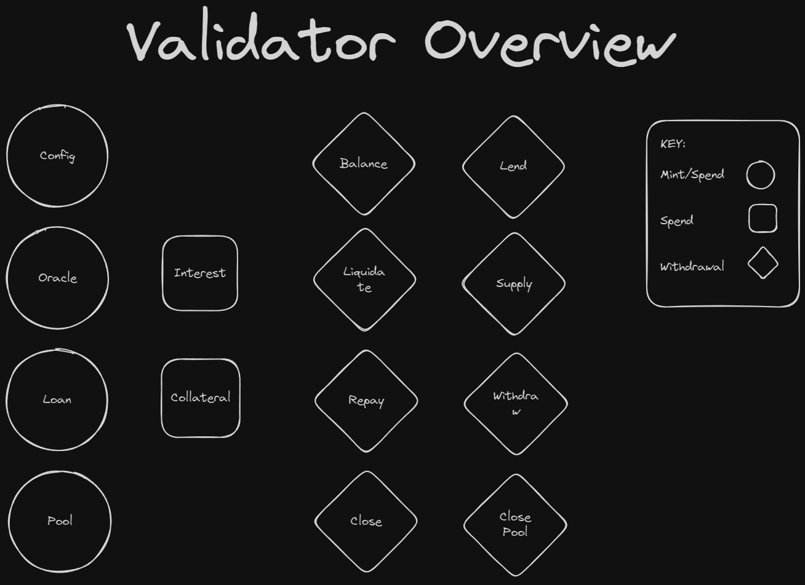
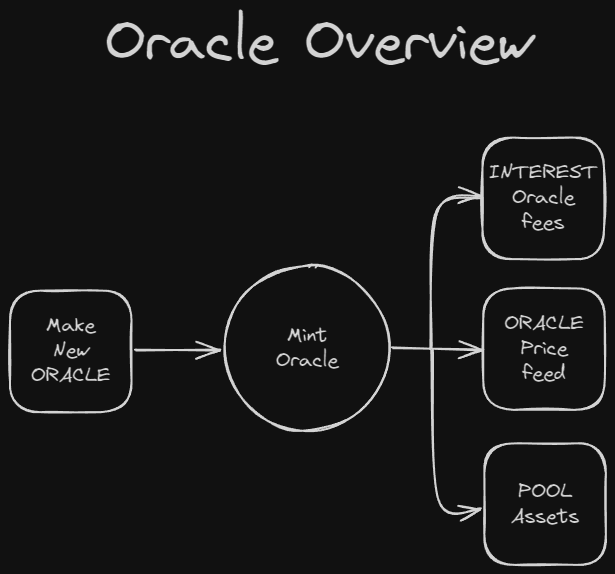
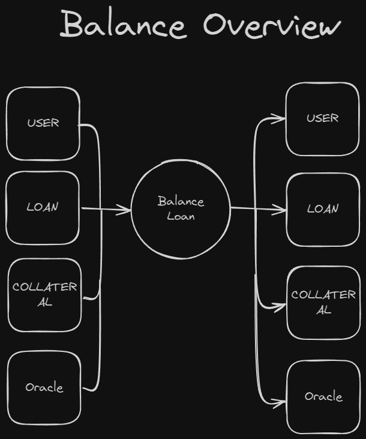
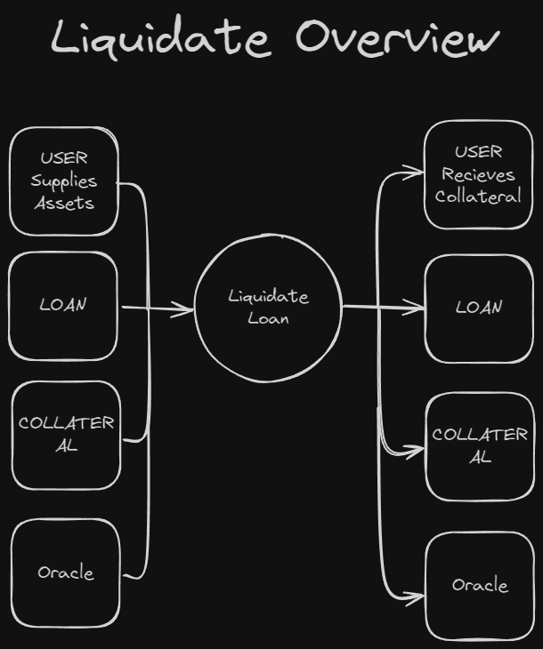
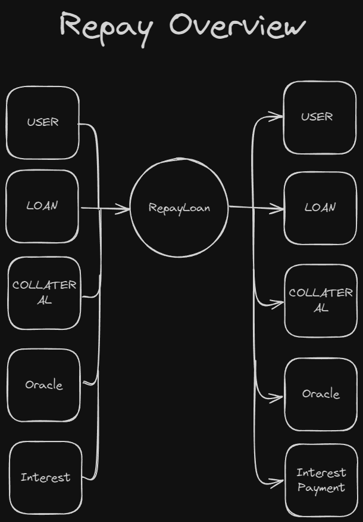
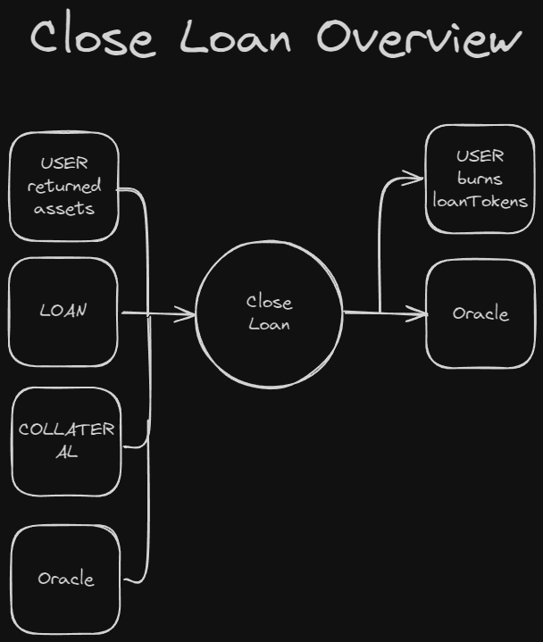
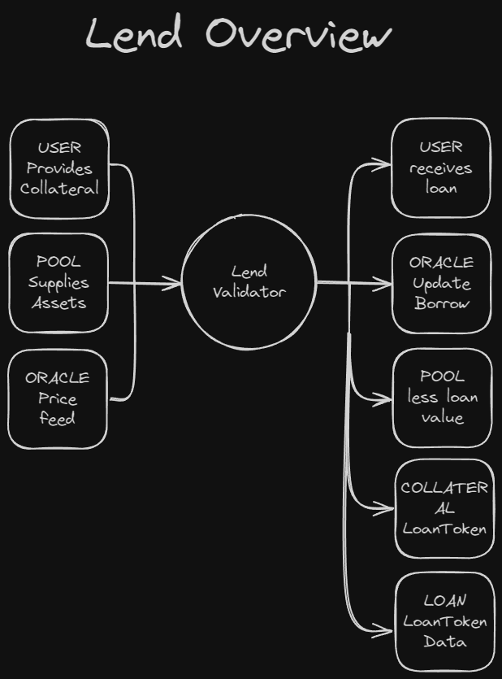
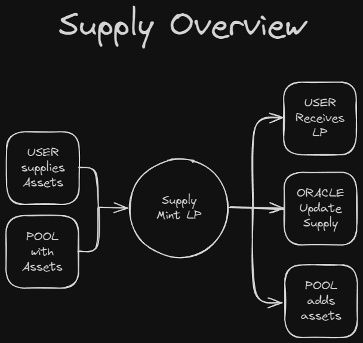
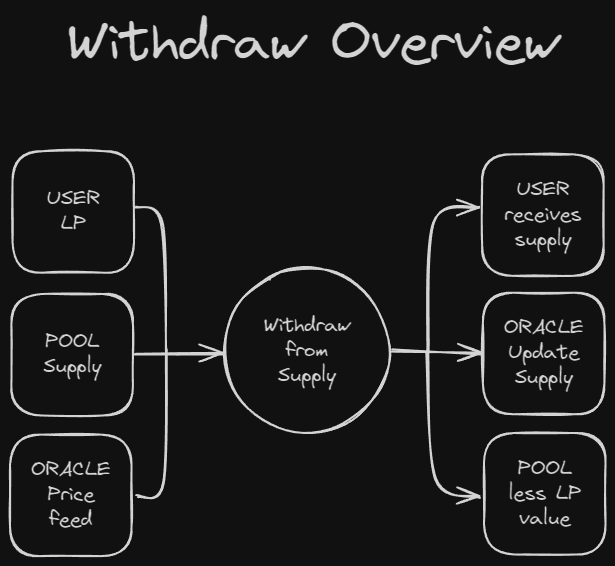
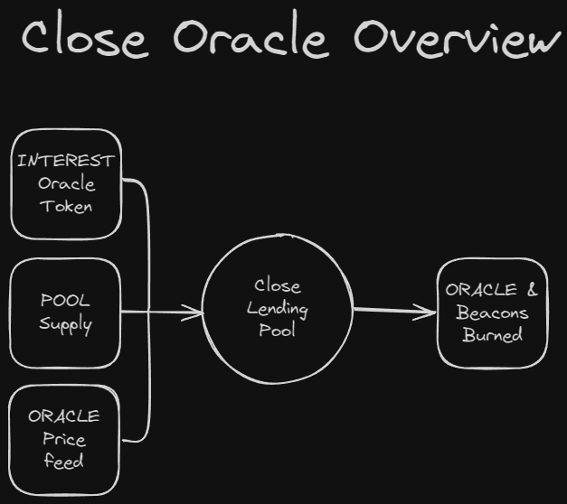

# V3 Validator Architecture

This document describes the validator architecture for the upcoming version V3, which
add the crypto lending features on top of our current fiat lending platform.

---

## V3 Validator Overview

### Project Scope

The scope of the V3 validators is to create a crypto lending protocol and integrate it
into the current validators.

### Design Scope

There are several different things we need to add to this project:

  - Supply Pools for holding and managing assets available for lending
  - Supplying assets to the pools
  - Withdrawing assets from the pool
  - Lending crypto assets from the pool
  - Closing pools to remove them from the application

Update New validators to integrate these features:

  - Oracles need to be tied to lending pools to manage the price
  - Loans need to be taken out for both fiat and crypto
  - Interest and fees need to be managed for the lending pools
  - LP tokens need to be minted and burned as assets are supplied to the pools

---

## V3 Validators

There are currently 14 different validators in the V3 protocol, and these validators 
can be organised into 3 distinct categories:

1. Minting/Locking
2. Locking
3. State Validators

Generally speaking, category 1 are the main protocol validators, category 2 support 1,
and finally category 3 manage transaction state and are responsible fo the overall
validation of transactions.

We will look at each of these in more detail below.

---

## Validator Overview



The main shapes represent the various functions each validator plays in the architecture.

## Minting/Spending

These validators are necessary for managing the minting of dapp state tokens to perform
the necessary roles in the dapp.

### Config Validator

The Config validator manages the state of the validators.

It mints and locks a `configToken` which stores the `ScriptHash` of all of the protocol 
validators which are used for the various functions the platform needs to perfom.

```
pub type MerkelConfigDatum {
  loanVal: ScriptHash,
  colVal: ScriptHash,
  oracleVal: ScriptHash,
  interestVal: ScriptHash,
  supplyVal: ScriptHash,
  collateralRedeemers: List<ScriptHash>,
  supplyRedeemers: List<ScriptHash>,
}
```

This is used as a reference input for the other validators to check that the appropriate 
actions are validated correctly.

### Oracle Validator

This validator manages the price feeds for assets onchain. 

For each asset we make available for lending, we need a unique oracle comprised of 3 
tokens, each stored in its own validator, with a specific datum relating to its function
in the `3 oracleToken` system.



#### `Oracle` Price Token

This Token is locked in the `oracleValidator` and holds the price data along with the current supply/borrowed assets.

```
pub type OracleDatum {
  exchange: Int,
  timestamp: Int,
  currency: ByteArray,
  supply: Int,
  borrowed: Int,
}
```

#### `Interest` Token

This Token is locked in the `interestValidator` and separates the fee structure from
the price feed, as it is only needed when repayments are being calculated.

```
pub type InterestDatum {
  base: Int,
  optimal: Int,
  slope1: Int,
  slope2: Int,
  term: Int,
}
```

#### `Supply` Token

This is locked into the `poolValidator` where it holds information on the asset pool it 
is responsible for tracking.

```
pub type SupplyDatum {
  policy: ByteArray,
  asset: ByteArray,
}
```

Because they are all the same token, it makes it easy to match up the correct supply 
pool with the appropriate price feed and fee structure when they are needed for the
different actions performed by the platform.

### Loan Validator

This validator is responsible for minting the `loanTokens` when someone takes a loan out 
on the platform.

There are 2 `loanTokens` minted for a given loan, one contains the loan data, the other
manages the collateral.

#### `Loan` Token

The loan token is locked in the `loanValidator` and is responsible for tracking the loan
data and managing its state.

```
pub type LoanDatum {
  amount: Int,
  rewards: Int,
  term: Int,
  timestamp: Int,
  oracle: AssetName,
  pkh: ByteArray,
}
```

The `LoanDatum` holds the `pubKeyHash` of the person taking the loan, and also the 
`oracleToken` so we can easily validate the correct oracle when interaction with the loan
onchain.

#### `Collateral` Token

This token gets locked in the `collateraValidator` and is responsible for locking and 
validating the loan collateral.

```
pub type CollateralDatum {
  amount: Int,
  timestamp: Int,
}
```

### Pool Validator

The Pool validator is responsible for managing the different `supplyPools` and 
mints/burns LP tokens when anyone `supplies` or `withdraws` assets from the pools.

#### `LP` Minting

When a user deposits assets to the platform for lending, they mint `LP` tokens that 
represent the assets they have deposited.

These are used to withdraw their original assets in the future when they decide to remove
their assets from the supply.

#### `Pool` Spending

The spending purpose of this validator is to hold the supplied assets in a UTxO with the 
`Supply` oracle token.

(See `Supply` Token above)

---

## Spending

Spending specific validators are used to lock the various tokens according to the data that they are responsible for managing.

### Interest Validator

The interest validator locks an `oracleToken` with an `interestDatum` that contains the 
fee sturcture for the assets it is responsible for.

(See `Interest` Token above)

### Collateral Validator 

this validator locks the collateral of a loan with its `loanToken` and the `collateralDatum`.

(See `Collateral` Token above)

---

## State Validators

State Validators are responsible for validating all of the components of a transaction
specific to the action being taken by the protocol.

You could think of them as validating `Actions` that users of the platform can perform, 
and they aggregate the various oracle/loan/pool data to validate the full state of the
particular action.

### Balance Validator

This is responsible for validating `loan/collateral` balancing, it is used when a user
needs to update their collateral according to the current price of the assets they are 
lending.



The balance validator expects the required `loan/collateral` inputs as well as checking
that the `oracle` price feed is updated.

It makes sure that the collateral output is accurate based on the oracle `exchangeRate`
and that all tracking data is updated and returned to its appropriate validator.

### Liquidate Validator

This validator enables loan liquidations when the `LTV` ratio falls below its threshold
of 85%.

Then anyone can effectively settle the loan on behalf of the borrower and withdraw the collateral (minus any protocol fees).



It also updates the oracle `exchangeRate` at the output and ensures any crypto assets 
(if it is a crypto loan) are deposited back into the supply.

### Repay Validator

This validator ensures repayments are done appropriately. It validates any interest and 
fee payments as well as updating the oracle `exchangeRate` and any amount of loan that 
is returned, also allows for the corresponding collateral to be withdrawn from the 
`collateralValidator`



### Close Loan Validator

When the full loan is repaid, the user will then be able to close the loan and burn the 
`loanTokens`

This validator allows the burning of the `loanToken` pair from the `loanValidator` and 
the `collateralValidator`



### Lend Validator

Borrowing Fiat or Crypto assets are managed by this validator.



The `oracleTokens` matching the assets being borrowed (pool input & oracle input) are
checked, as is the collateral deposited.

It checks the `loanTokens` are minted and they go to the appropriate validators along
with the collateral and loan datums.

It also sends the supply to the user taking the loan (crypto) and updates the fields in
the `oracleDatum` or just updates the `oracleDatum` and threads the pool input for 
validation (fiat).

### Supply Validator 

Supplying assets to the lending pool is a key part of the crypto lending feature of the protocol.



This validator checks that any supplied assets go to the appropiate pool and that the
`oracleDatum` is updated accordingly.

It also checks that the correct amount of `LP tokens` are minted.

### Withdraw Validator

This validator is responsible for allowing people to withdraw their supplied assets from the supply pool.

 

It makes sure the correct amount of assets are removed from the pool, and that the 
appropriate amount of `LP tokens` are burned.

It also checks that the `oracleDatum` is updated accordingly.

### Close Pool/Oracle

If the platform removes an asset from the lending platfrom, this validator makes sure 
that the supplyPool and oracle are cleaned up and burned appropriately, to prevent leaky
tokens and other potential vulnerabilities.

This can only happen if the supply pool is empty, and that there are no active loans out 
for that asset.

